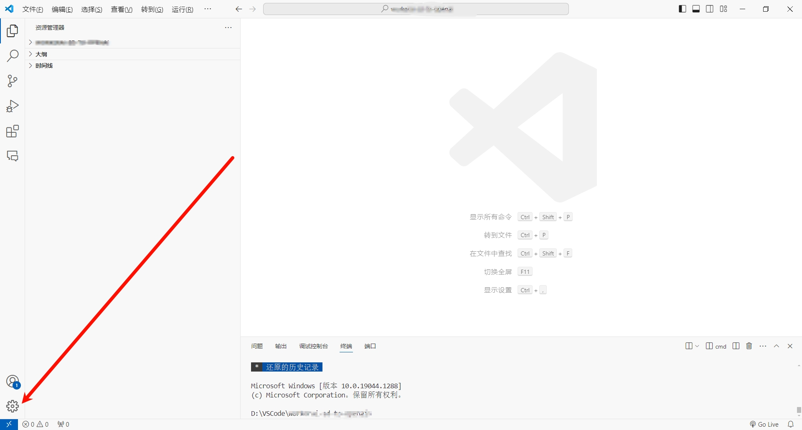
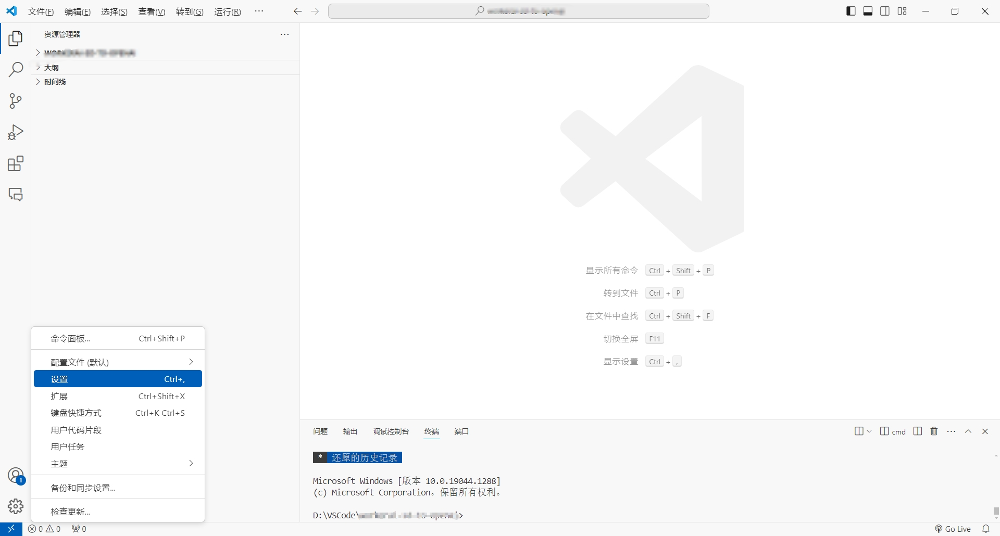
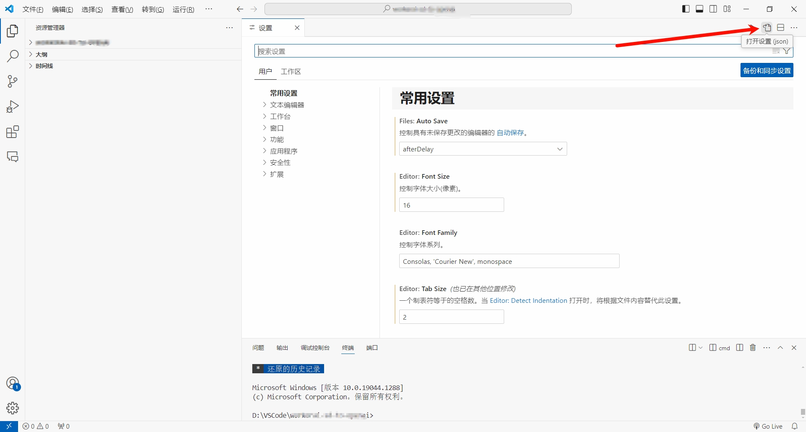
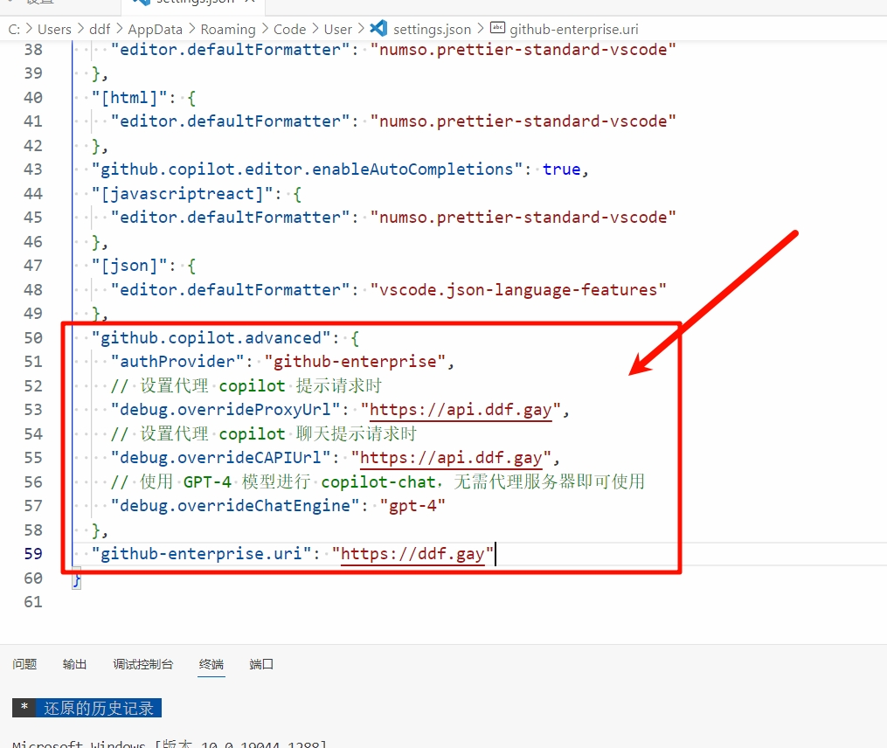
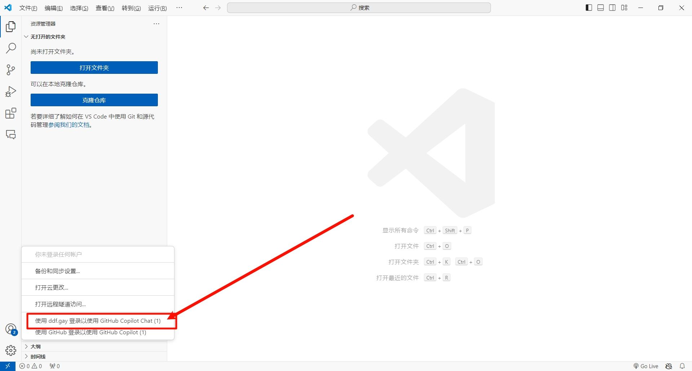
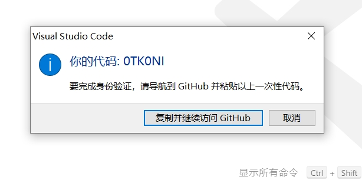
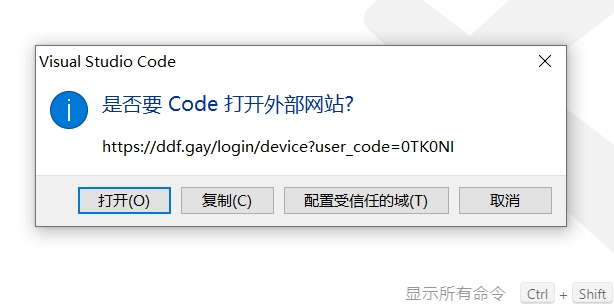
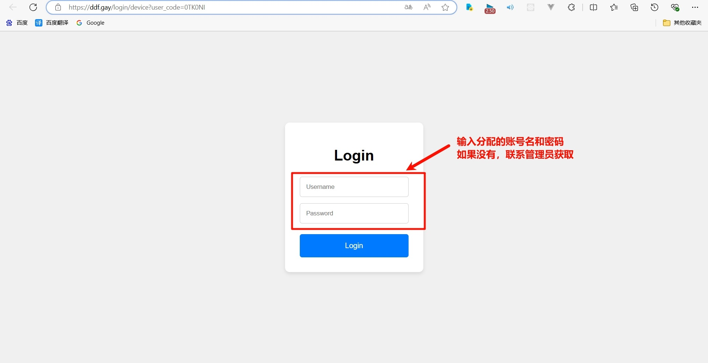
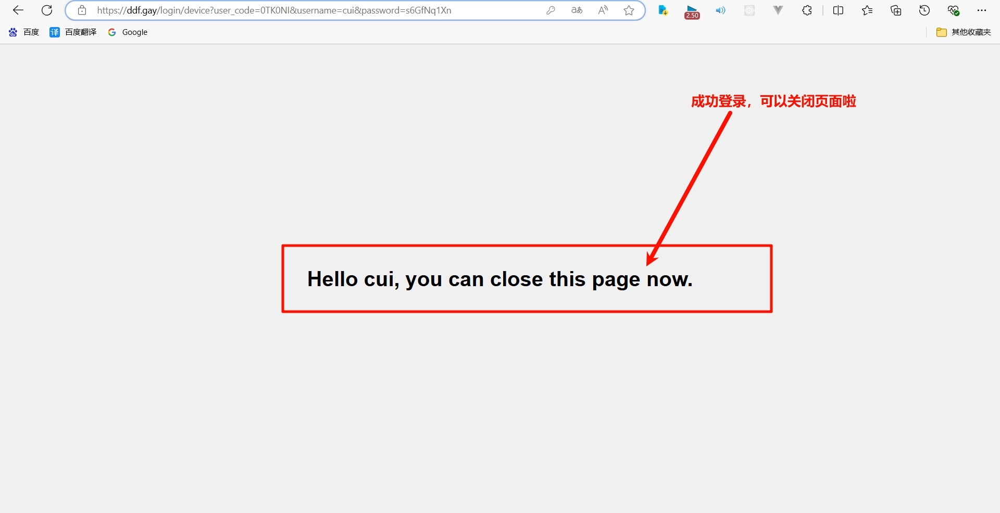
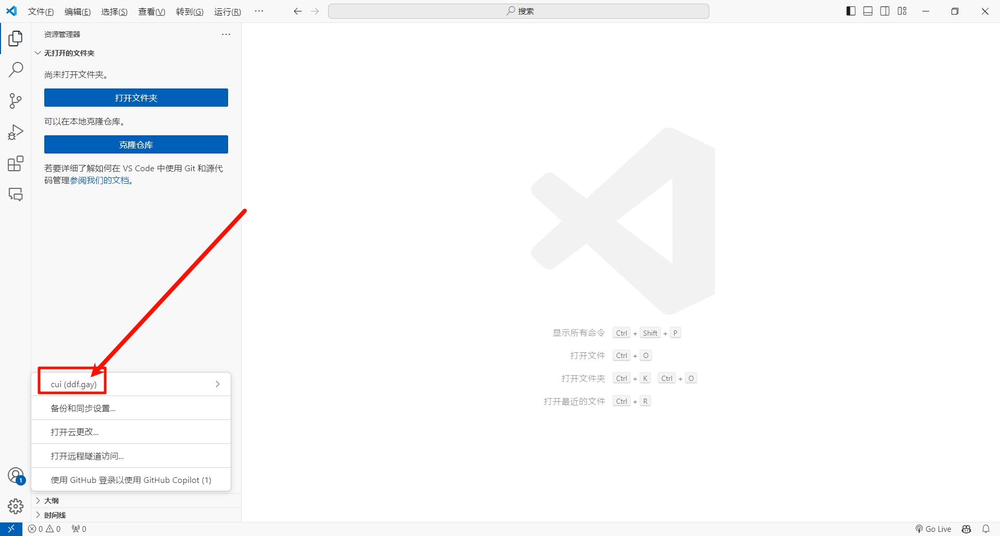

# GitHub Copilot 共享

## 一、VSCode

### 1. 安装 GitHub Copilot 插件

安装 GitHub Copilot 插件（如果尚未安装）。


### 2. 点击 VSCode 设置按钮



### 3. 打开设置界面



### 4. 打开 settings.json



### 5. 修改 VSCode 设置

通过在您的 `settings.json` 文件中添加以下配置来使用此代理：

```json
{
    "github.copilot.advanced": {
        "authProvider": "github-enterprise",
        // 设置代理 copilot 提示请求时
        "debug.overrideProxyUrl": "https://api.ddf.gay",
        // 设置代理 copilot 聊天提示请求时
        "debug.overrideCAPIUrl": "https://api.ddf.gay",
        // 使用 GPT-4 模型进行 copilot-chat，无需代理服务器即可使用
        "debug.overrideChatEngine": "gpt-4",
    },
    "github-enterprise.uri": "https://ddf.gay",
}
```



### 6. 登录 Copilot 账号



点击【复制并继续访问 GitHub】



点击【打开(0)】



跳转到默认浏览器并打开登录地址。



输入分配的账号和密码，如果正确，来到成功 ✌️ 页面。



之后回到 VSCode，看到登录的用户账号了。



### 7. 使用 Copilot


## 二、IntelliJ IDEA

### 1. 设置环境变量

在您的系统上配置以下环境变量。

```
GH_COPILOT_OVERRIDE_PROXY_URL=https://api.ddf.gay
GH_COPILOT_OVERRIDE_CAPI_URL=https://api.ddf.gay
```

### 2. 配置 IDEA

配置 IntelliJ IDEA 中的 GitHub Copilot 插件：

- 转到 `设置` > `语言与框架` > `GitHub Copilot` > `认证`。
- 将 `认证提供者` 设置为 `https://ddf.gay`。

